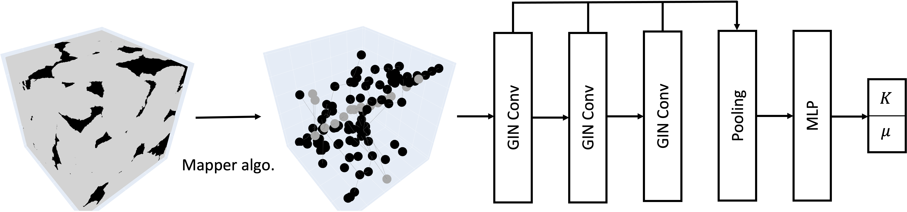
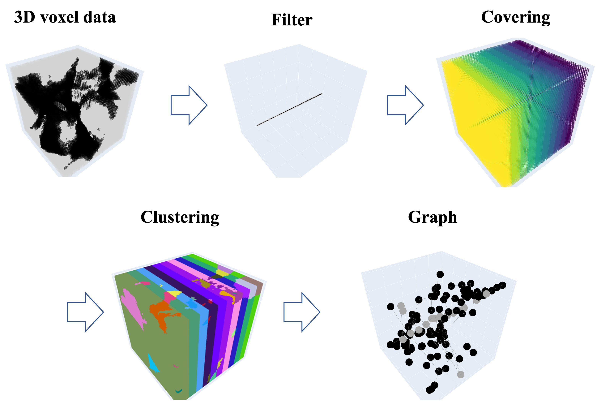

# Prediction of Effective Elastic Moduli of Rocks using Graph Neural Networks


*Workflow: Conversion of a digital rock into a graph via the Mapper algorithm, followed by the utilization of
GNN for elastic moduli prediction*

## Abstract
This study presents a Graph Neural Networks (GNNs)-based approach for predicting the effective elastic moduli of rocks from their digital CT-scan images. We use the Mapper algorithm to transform 3D digital rock images into graph datasets, encapsulating essential geometrical information. These graphs, after training, prove effective in predicting elastic moduli. Our GNN model shows robust predictive capabilities across various graph sizes derived from various subcube dimensions. Not only does it perform well on the test dataset, but it also maintains high prediction accuracy for unseen rocks and unexplored subcube sizes. Comparative analysis with Convolutional Neural Networks (CNNs) reveals the superior performance of GNNs in predicting unseen rock properties. Moreover, the graph representation of microstructures significantly reduces GPU memory requirements (compared to the grid representation for CNNs), enabling greater flexibility in the batch size selection. This work demonstrates the potential of GNN models in enhancing the prediction accuracy of rock properties and boosting the efficiency of digital rock analysis. 


*The process of graph construction using the Mapper algorithm: (a) Original 3D voxel data where gray represents
grain and black represents pore, (b) Projection on the 𝑋-axis using the filter function, (c) Covering procedure dividing the
domain into 10 regions, (d) Clustering of pore and solid structures using DFS algorithm, (e) The resulting graph 𝐺(𝑉 ,𝐸)*

## Code usage
To use this code, follow these steps:

1. **Clone the Repository:**
    ```
    git clone https://github.com/jh-chung1/GNN_ElasticModulus_Prediction.git
    ```
    
2. **Install Dependencies:**
    ```
    conda env create -f environment.yml
    conda activate GNN_ElasticModulus_Prediction
    ```
    
3. **Conver voxel data to graph data:**
    ```
    python mapper_DFS.py --start_no 1 --end_no 2 --subcube 90 --cover_interval 20 --overlap 0.3
    ```


4. **Train & Evaluate the Model:**
    ```
    python train_predict.py --batch_num 64 --epoch_num 200 --cover_interval 20 --overlap 0.3 --save_model_dir './examples/saved_GNN_model'
    ```

## Graph dataset
[graph dataset download](https://drive.google.com/drive/folders/1iE5H7Fi3g3yTIZmL24y5xD0In58pHYyB?usp=share_link)

## Citation
If you use this work or code in your research, please consider citing our [paper](https://arxiv.org/abs/2310.19274):

    
    @article{chung2023prediction,
    title={Prediction of Effective Elastic Moduli of Rocks using Graph Neural Networks},
    author={Chung, Jaehong and Ahmad, Rasool and Sun, WaiChing and Cai, Wei and Mukerji, Tapan},
    journal={arXiv preprint arXiv:2310.19274},
    year={2023}
    }
    
